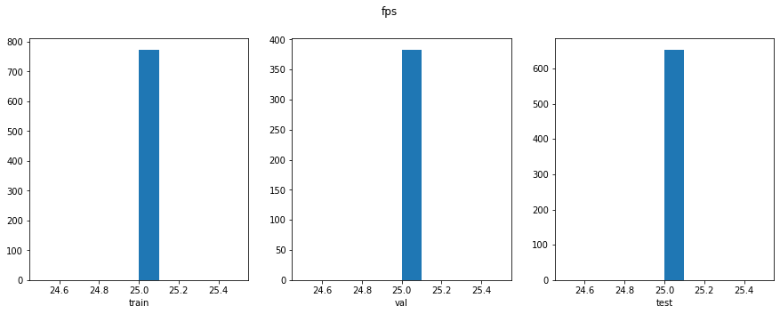
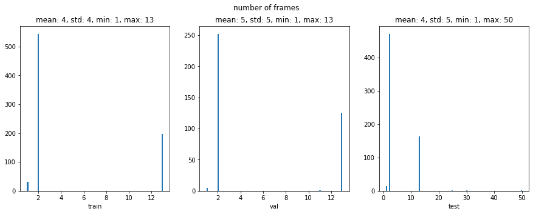
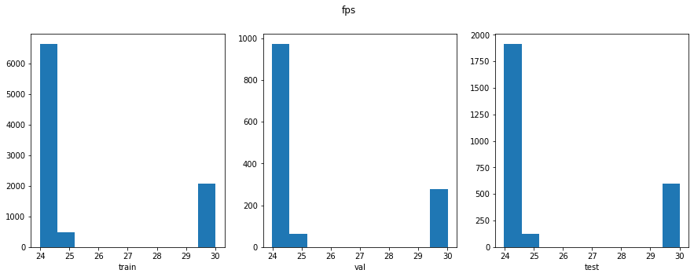
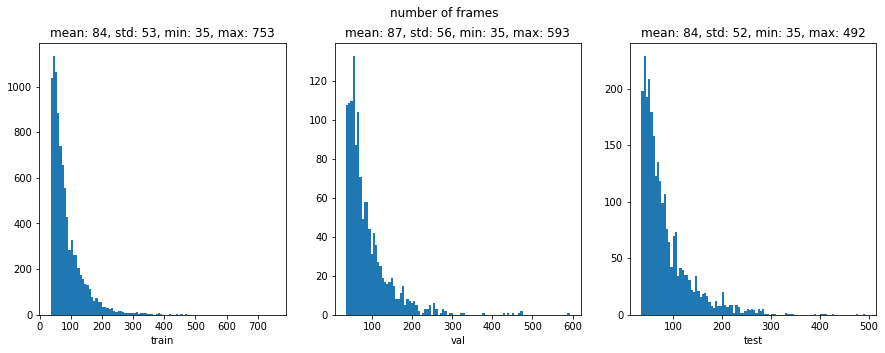

# Datasets

## Supported datasets
There are three datasets:

1. [MELD](https://affective-meld.github.io/)

1. [IEMOCAP](https://sail.usc.edu/iemocap/)

1. [AFEW](https://cs.anu.edu.au/few/AFEW.html)

1. [CAER](https://caer-dataset.github.io/)

Out of the three modalities (text, audio, and visual), the above datasets have at least two of them, if not all three.

## Instructions

**If you want to skip the tedious boring instructions below, then just download the pre-computed files from here. Once you downloaded the below for archives, then proceed to [After everything](#After-everything)**

1. [MELD](https://drive.google.com/file/d/1YZ9Zz_TdRaYsM6Lwx34IwpFgiVLNIAZ6/view?usp=sharing)

1. [IEMOCAP](https://drive.google.com/file/d/1iq6ocRu3jkQgyVMmKj5EGb9A_wBmxzGh/view?usp=sharing)

1. [AFEW](https://drive.google.com/file/d/1vQqFgc1jNW7t5Y7JhsmyoWwNISG5LkwU/view?usp=sharing)

1. [CAER](https://drive.google.com/file/d/1olBRpquSwORBrork9mbsJ9EQXY9n2y9u/view?usp=sharing)

### Download the original datasets

You have to download the original datasets yourselves from the original authors. If you click on the links, the authors tell you how to download them. Some of them can be downloaded directly while some ask you to write them emails. Anyways, if you get them, they'll look like this:

```
├── CAER.zip
├── EmotiW_2018.zip
├── IEMOCAP_full_release.tar.gz
├── MELD.Raw.tar.gz
```
Btw, AFEW is `EmotiW_2018.zip`. Have them here in this directory (i.e. `root/of/the/repo/Datasets`). Don't change the archive names. 

### Clean the datasets

Run the bash script by

```
bash scripts/clean.sh
```
This might take a while ...

- You need to have some Unix programs installed (i.e. ffmpeg, unrar, untar, unzip, and python3, gdown). They are probably already installed if you are an average Unix user. The original datasets will be saved at `DEBUG/` and symbolic links to them will be made to save space.

- Although the quality of IEMOCAP is decent, the way the things are organized is very messy. That's why there is a file `iemocap-DeCLaRe.json` to help with this. This was not made by me, but by [DeCLaRe](https://github.com/declare-lab/conv-emotion). I took the same train / val / test splits as them.

- The AFEW dataset officially does not have the test labels.


### Extract facial features

You can either compute the features yourself or download them.

- If you want to download the pre-computed features (recommended)
    ```
    bash scripts/face.sh download
    ```


- If you want to compute them in your machine (not recommended. might take some time), `face.sh` takes three positional arguments $1, $2, and $3. $1 should be either `download` or `compute`. $2 should be number of jobs (e.g. 4). $3 should be the gpu-id (-1 means CPU). For example, if you want to compute with 4 jobs and use the gpu-id of 0,
    ```
    bash scripts/face.sh compute 4 0
    ```
    >`insightface` has to be installed before running this. See this repo:https://github.com/deepinsight/insightface. After cloning this repo, go to the `python-package` from the root repo directory and install it by `pip install .` Btw, this is the best human face repo I've seen so far. The only caveat is that the core deep learning framework used is neither pytorch nor tensorflow, but mxnet.

### After everything

After you've either downloaded or computed, your current directory `Datasets` should look like this:

```
AFEW
├── faces
│   ├── test [653 entries exceeds filelimit, not opening dir]
│   ├── train [773 entries exceeds filelimit, not opening dir]
│   └── val [383 entries exceeds filelimit, not opening dir]
├── raw-audios
│   ├── test [653 entries exceeds filelimit, not opening dir]
│   ├── train [773 entries exceeds filelimit, not opening dir]
│   └── val [383 entries exceeds filelimit, not opening dir]
├── raw-videos
│   ├── test [653 entries exceeds filelimit, not opening dir]
│   ├── train [773 entries exceeds filelimit, not opening dir]
│   └── val [383 entries exceeds filelimit, not opening dir]
├── labels.json
└── README.txt
CAER
├── faces
│   ├── test [2637 entries exceeds filelimit, not opening dir]
│   ├── train [9222 entries exceeds filelimit, not opening dir]
│   └── val [1316 entries exceeds filelimit, not opening dir]
├── raw-audios
│   ├── test [2637 entries exceeds filelimit, not opening dir]
│   ├── train [9222 entries exceeds filelimit, not opening dir]
│   └── val [1316 entries exceeds filelimit, not opening dir]
├── raw-videos
│   ├── test [2637 entries exceeds filelimit, not opening dir]
│   ├── train [9222 entries exceeds filelimit, not opening dir]
│   └── val [1316 entries exceeds filelimit, not opening dir]
├── labels.json
└── README.txt
IEMOCAP
├── faces
│   ├── test [2170 entries exceeds filelimit, not opening dir]
│   ├── train [6378 entries exceeds filelimit, not opening dir]
│   └── val [1491 entries exceeds filelimit, not opening dir]
├── raw-audios
│   ├── test [2170 entries exceeds filelimit, not opening dir]
│   ├── train [6378 entries exceeds filelimit, not opening dir]
│   └── val [1491 entries exceeds filelimit, not opening dir]
├── raw-texts
│   ├── test [2170 entries exceeds filelimit, not opening dir]
│   ├── train [6378 entries exceeds filelimit, not opening dir]
│   └── val [1491 entries exceeds filelimit, not opening dir]
├── raw-videos
│   ├── test [2170 entries exceeds filelimit, not opening dir]
│   ├── train [6378 entries exceeds filelimit, not opening dir]
│   └── val [1491 entries exceeds filelimit, not opening dir]
├── labels.json
├── README.txt
├── undecided.json
└── utterance-ordered.json
MELD
├── faces
│   ├── test [2747 entries exceeds filelimit, not opening dir]
│   ├── train [9988 entries exceeds filelimit, not opening dir]
│   └── val [1112 entries exceeds filelimit, not opening dir]
├── raw-audios
│   ├── test [2747 entries exceeds filelimit, not opening dir]
│   ├── train [9988 entries exceeds filelimit, not opening dir]
│   └── val [1112 entries exceeds filelimit, not opening dir]
├── raw-texts
│   ├── test [2610 entries exceeds filelimit, not opening dir]
│   ├── train [9989 entries exceeds filelimit, not opening dir]
│   └── val [1109 entries exceeds filelimit, not opening dir]
├── raw-videos
│   ├── test [2747 entries exceeds filelimit, not opening dir]
│   ├── train [9989 entries exceeds filelimit, not opening dir]
│   └── val [1112 entries exceeds filelimit, not opening dir]
├── labels.json
├── README.txt
└── utterance-ordered.json
README.md [error opening dir]
scripts [19 entries exceeds filelimit, not opening dir]
```

### How to use the datasets

Check out `scripts/datasets-demo.ipynb`

## Some useful stats of the datasets

| MELD  | anger | disgust | fear | joy  | neutral | sadness | surprise | SUM  |
| ----- | ----- | ------- | ---- | ---- | ------- | ------- | -------- | ---- |
| train | 1109  | 271     | 268  | 1743 | 4710    | 683     | 1205     | 9989 |

| MELD | anger | disgust | fear | joy | neutral | sadness | surprise | SUM  |
| ---- | ----- | ------- | ---- | --- | ------- | ------- | -------- | ---- |
| val  | 153   | 22      | 40   | 163 | 470     | 111     | 150      | 1109 |

| MELD | anger | disgust | fear | joy | neutral | sadness | surprise | SUM  |
| ---- | ----- | ------- | ---- | --- | ------- | ------- | -------- | ---- |
| test | 345   | 68      | 50   | 402 | 1256    | 208     | 281      | 2610 |

---

| IEMOCAP | anger | disgust | excited | fear | frustration | happiness | neutral | other | sadness | surprise | undecided | SUM  |
| ------- | ----- | ------- | ------- | ---- | ----------- | --------- | ------- | ----- | ------- | -------- | --------- | ---- |
| train   | 749   | 2       | 520     | 25   | 1210        | 338       | 1080    | 2     | 764     | 70       | 1618      | 6378 |

| IEMOCAP | anger | excited | fear | frustration | happiness | neutral | other | sadness | surprise | undecided | SUM  |
| ------- | ----- | ------- | ---- | ----------- | --------- | ------- | ----- | ------- | -------- | --------- | ---- |
| val     | 184   | 222     | 5    | 258         | 114       | 244     | 1     | 75      | 19       | 369       | 1491 |

| IEMOCAP | anger | excited | fear | frustration | happiness | neutral | sadness | surprise | undecided | SUM  |
| ------- | ----- | ------- | ---- | ----------- | --------- | ------- | ------- | -------- | --------- | ---- |
| test    | 170   | 299     | 10   | 381         | 143       | 384     | 245     | 18       | 520       | 2170 |

---

| AFEW  | angry | disgust | fear | happy | neutral | sad | surprise | SUM |
| ----- | ----- | ------- | ---- | ----- | ------- | --- | -------- | --- |
| train | 133   | 74      | 81   | 150   | 144     | 117 | 74       | 773 |

| AFEW | angry | disgust | fear | happy | neutral | sad | surprise | SUM |
| ---- | ----- | ------- | ---- | ----- | ------- | --- | -------- | --- |
| val  | 64    | 40      | 46   | 63    | 63      | 61  | 46       | 383 |

| AFEW | SUM |
| ---- | --- |
| test | 0   |

---

| CAER  | anger | disgust | fear | happy | neutral | sad  | surprise | SUM  |
| ----- | ----- | ------- | ---- | ----- | ------- | ---- | -------- | ---- |
| train | 1136  | 500     | 358  | 1905  | 3202    | 1028 | 1093     | 9222 |

| CAER | anger | disgust | fear | happy | neutral | sad | surprise | SUM  |
| ---- | ----- | ------- | ---- | ----- | ------- | --- | -------- | ---- |
| val  | 162   | 71      | 51   | 272   | 457     | 146 | 157      | 1316 |

| CAER | anger | disgust | fear | happy | neutral | sad | surprise | SUM  |
| ---- | ----- | ------- | ---- | ----- | ------- | --- | -------- | ---- |
| test | 325   | 145     | 102  | 544   | 915     | 294 | 312      | 2637 |


## Some more useful stats of the datasets

You can see how I get this stats at `scripts/get-more-stats.ipynb`

### MELD


### IEMOCAP


### AFEW




### CAER


