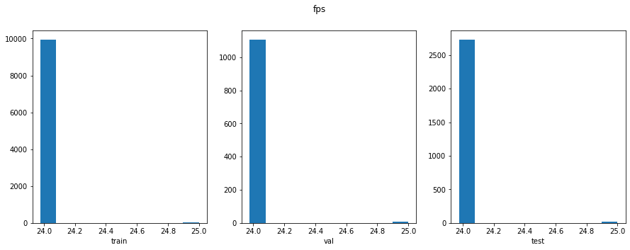
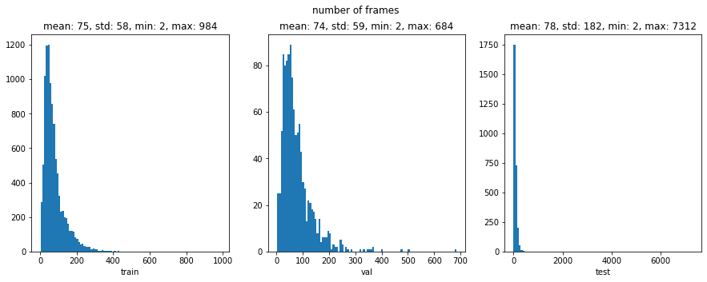
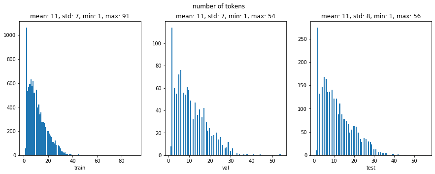
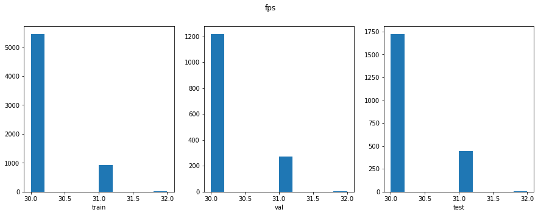
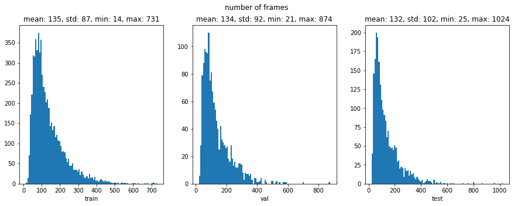
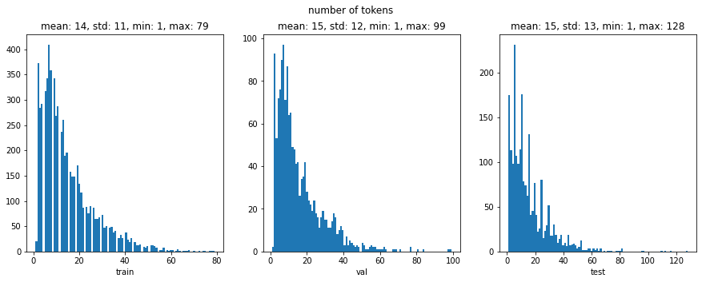

# Datasets

## Supported datasets
There are three datasets:

1. [MELD](https://affective-meld.github.io/)

1. [IEMOCAP](https://sail.usc.edu/iemocap/)

1. [EmoryNLP](https://github.com/emorynlp/emotion-detection)

1. [DailyDialog](http://yanran.li/dailydialog.html)

We only include the datasets where the speaker emotion is labeled. Our goal is to recognize speaker emotion in conversation. **At the moment we find that only MELD, IEMOCAP, EmoryNLP, and DailyDialog are only relevant to us.** MELD and IEMOCAP have all of the three modalities (i.e. text, audio, and vision), whereas the other two datasets only have the text modality.

## Easy Instructions

**Just download what you want from the link below, or use `wget` in terminal if you prefer CLI.**

MELD
* [MELD-raw-texts.zip](https://surfdrive.surf.nl/files/index.php/s/lkynQhyyjvEwAxP/download) 
* [MELD-raw-audios.zip](https://surfdrive.surf.nl/files/index.php/s/vpCOCBXiw0Y5L0t/download)
* [MELD-raw-videos.zip](https://surfdrive.surf.nl/files/index.php/s/6bqQomRnOdz3fmT/download)
* [MELD-faces.zip](https://surfdrive.surf.nl/files/index.php/s/1CsIG1PM76uIbfh/download)

IEMOCAP
* [IEMOCAP-raw-texts.zip](https://surfdrive.surf.nl/files/index.php/s/keCqqQIjhKM0RuA/download)
* [IEMOCAP-raw-audios.zip](https://surfdrive.surf.nl/files/index.php/s/HpidwdWbyksoxu8/download)
* [IEMOCAP-raw-videos.zip](https://surfdrive.surf.nl/files/index.php/s/fcwsX6oAV66WIwd/download)
* [IEMOCAP-faces.zip](https://surfdrive.surf.nl/files/index.php/s/pGMV6yrZLQS66yu/download)

EmoryNLP
* [EmoryNLP-raw-texts.zip](https://surfdrive.surf.nl/files/index.php/s/H7Xi2GXsbdbLC0m/download)

DailyDialog
* [DailyDialog-raw-texts.zip](https://surfdrive.surf.nl/files/index.php/s/snRTulgLM2F9pj8/download)

Once you've finished downloading what you need, proceed to [After everything](#After-everything)

## Difficult Instructions

You probably don't want to do this but it might give you a feeling of fulfillment

### Download the original datasets

You have to download the original datasets yourselves from the original authors. If you click on the links, the authors tell you how to download them. Some of them can be downloaded directly while some ask you to write them emails. Anyways, if you get them, they'll look like this:

```console
├── emotion-detection-emotion-detection-1.0.tar.gz
├── IEMOCAP_full_release.tar.gz
├── ijcnlp_dailydialog.zip
├── MELD.Raw.tar.gz
```

### Clean the datasets

Run the shell script by

```bash
bash scripts/clean.sh
```
This might take a while ...

- You need to have some Unix programs installed (i.e. ffmpeg, unrar, untar, unzip, and python3). They are probably already installed if you are an average Unix user. The original datasets will be saved at `DEBUG/`.

- The IEMOCAP dataset officially does not have train / val / test split. We follow the splits made by the authors of [DialogXL: All-in-One XLNet for Multi-Party Conversation Emotion Recognition](https://arxiv.org/abs/2012.08695), so that we can compare our experiment results with the other researchers.


### Extract facial features

You can either compute the features yourself or download them.

- If you want to download the pre-computed features from the links or use `wget` if you prefer CLI. (recommended)

    * [MELD-faces.zip](https://surfdrive.surf.nl/files/index.php/s/1CsIG1PM76uIbfh/download)

    * [IEMOCAP-faces.zip](https://surfdrive.surf.nl/files/index.php/s/pGMV6yrZLQS66yu/download)

- If you want to compute them in your machine (not recommended. might take some time), `face.sh` takes three positional arguments $1, $2, and $3. $1 should be either `download` or `compute`. $2 should be number of jobs (e.g. 4). $3 should be the gpu-id (-1 means CPU). For example, if you want to compute with 4 jobs and use the gpu-id of 0,
    ```bash
    bash scripts/face.sh compute 4 0
    ```
    >`insightface` has to be installed before running this. See this repo:https://github.com/deepinsight/insightface. After cloning this repo, go to the `python-package` from the root repo directory and install it by `pip install -e .` Btw, this is the best human face repo I've seen so far. The only caveat is that the core deep learning framework used is neither pytorch nor tensorflow, but mxnet.

## After everything

After you've either downloaded or computed, your current directory `Datasets` should look like this:

```console
├── DailyDialog
│   ├── raw-texts
│   │   ├── test [7740 entries exceeds filelimit, not opening dir]
│   │   ├── train [87170 entries exceeds filelimit, not opening dir]
│   │   └── val [8069 entries exceeds filelimit, not opening dir]
│   ├── labels.json
│   ├── README.txt
│   └── utterance-ordered.json
├── EmoryNLP
│   ├── raw-texts
│   │   ├── test [1328 entries exceeds filelimit, not opening dir]
│   │   ├── train [9934 entries exceeds filelimit, not opening dir]
│   │   └── val [1344 entries exceeds filelimit, not opening dir]
│   ├── labels.json
│   ├── README.txt
│   └── utterance-ordered.json
├── IEMOCAP
│   ├── faces
│   │   ├── test [2170 entries exceeds filelimit, not opening dir]
│   │   ├── train [6468 entries exceeds filelimit, not opening dir]
│   │   └── val [1401 entries exceeds filelimit, not opening dir]
│   ├── face-videos
│   │   ├── test [2170 entries exceeds filelimit, not opening dir]
│   │   ├── train [6468 entries exceeds filelimit, not opening dir]
│   │   └── val [1401 entries exceeds filelimit, not opening dir]
│   ├── raw-audios
│   │   ├── test [2170 entries exceeds filelimit, not opening dir]
│   │   ├── train [6468 entries exceeds filelimit, not opening dir]
│   │   └── val [1401 entries exceeds filelimit, not opening dir]
│   ├── raw-texts
│   │   ├── test [2170 entries exceeds filelimit, not opening dir]
│   │   ├── train [6468 entries exceeds filelimit, not opening dir]
│   │   └── val [1401 entries exceeds filelimit, not opening dir]
│   ├── raw-videos
│   │   ├── test [2170 entries exceeds filelimit, not opening dir]
│   │   ├── train [6468 entries exceeds filelimit, not opening dir]
│   │   └── val [1401 entries exceeds filelimit, not opening dir]
│   ├── labels.json
│   ├── README.txt
│   ├── undecided.json
│   └── utterance-ordered.json
├── MELD
│   ├── faces
│   │   ├── test [2747 entries exceeds filelimit, not opening dir]
│   │   ├── train [9988 entries exceeds filelimit, not opening dir]
│   │   └── val [1112 entries exceeds filelimit, not opening dir]
│   ├── face-videos
│   │   ├── test [2741 entries exceeds filelimit, not opening dir]
│   │   ├── train [9949 entries exceeds filelimit, not opening dir]
│   │   └── val [1109 entries exceeds filelimit, not opening dir]
│   ├── raw-audios
│   │   ├── test [2747 entries exceeds filelimit, not opening dir]
│   │   ├── train [9988 entries exceeds filelimit, not opening dir]
│   │   └── val [1112 entries exceeds filelimit, not opening dir]
│   ├── raw-texts
│   │   ├── test [2610 entries exceeds filelimit, not opening dir]
│   │   ├── train [9989 entries exceeds filelimit, not opening dir]
│   │   └── val [1109 entries exceeds filelimit, not opening dir]
│   ├── raw-videos
│   │   ├── test [2747 entries exceeds filelimit, not opening dir]
│   │   ├── train [9989 entries exceeds filelimit, not opening dir]
│   │   └── val [1112 entries exceeds filelimit, not opening dir]
│   ├── labels.json
│   ├── README.txt
│   └── utterance-ordered.json
└── README.md
```

## How to use the datasets

Check out `scripts/notebooks/datasets-demo.ipynb`

## Dataset stats

The below stats were made by `scripts/notebooks/get-stats.ipynb`

### MELD

|  SPLIT | SUM | neutral | joy | surprise | anger | sadness | disgust | fear |
|-------------- | -------------- | -------------- | -------------- | -------------- | -------------- | -------------- | -------------- | -------------- | 
| train | 9989 | 4710 | 1743 | 1205 | 1109 | 683 | 271 | 268 | 


|  SPLIT | SUM | neutral | joy | anger | surprise | sadness | fear | disgust |
|-------------- | -------------- | -------------- | -------------- | -------------- | -------------- | -------------- | -------------- | -------------- | 
| val | 1109 | 470 | 163 | 153 | 150 | 111 | 40 | 22 | 


|  SPLIT | SUM | neutral | joy | anger | surprise | sadness | disgust | fear |
|-------------- | -------------- | -------------- | -------------- | -------------- | -------------- | -------------- | -------------- | -------------- | 
| test | 2610 | 1256 | 402 | 345 | 281 | 208 | 68 | 50 | 

### IEMOCAP

|  SPLIT | SUM | undecided | neutral | frustration | sadness | anger | excited | happiness | surprise | fear | disgust | other |
|-------------- | -------------- | -------------- | -------------- | -------------- | -------------- | -------------- | -------------- | -------------- | -------------- | -------------- | -------------- | -------------- | 
| train | 6468 | 1587 | 1167 | 1149 | 739 | 711 | 620 | 392 | 76 | 23 | 2 | 2 | 


|  SPLIT | SUM | undecided | frustration | anger | neutral | excited | sadness | happiness | surprise | fear | other |
|-------------- | -------------- | -------------- | -------------- | -------------- | -------------- | -------------- | -------------- | -------------- | -------------- | -------------- | -------------- | 
| val | 1401 | 400 | 319 | 222 | 157 | 122 | 100 | 60 | 13 | 7 | 1 | 


|  SPLIT | SUM | undecided | neutral | frustration | excited | sadness | anger | happiness | surprise | fear |
|-------------- | -------------- | -------------- | -------------- | -------------- | -------------- | -------------- | -------------- | -------------- | -------------- | -------------- | 
| test | 2170 | 520 | 384 | 381 | 299 | 245 | 170 | 143 | 18 | 10 | 

### EmoryNLP

|  SPLIT | SUM | neutral | joyful | scared | mad | peaceful | powerful | sad |
|-------------- | -------------- | -------------- | -------------- | -------------- | -------------- | -------------- | -------------- | -------------- | 
| train | 9934 | 3034 | 2184 | 1285 | 1076 | 900 | 784 | 671 | 


|  SPLIT | SUM | neutral | joyful | scared | mad | powerful | peaceful | sad |
|-------------- | -------------- | -------------- | -------------- | -------------- | -------------- | -------------- | -------------- | -------------- | 
| val | 1344 | 393 | 289 | 178 | 143 | 134 | 132 | 75 | 


|  SPLIT | SUM | neutral | joyful | scared | peaceful | powerful | mad | sad |
|-------------- | -------------- | -------------- | -------------- | -------------- | -------------- | -------------- | -------------- | -------------- | 
| test | 1328 | 349 | 282 | 182 | 159 | 145 | 113 | 98 | 

### DailyDialog

|  SPLIT | SUM | neutral | happiness | surprise | sadness | anger | disgust | fear |
|-------------- | -------------- | -------------- | -------------- | -------------- | -------------- | -------------- | -------------- | -------------- | 
| train | 87170 | 72143 | 11182 | 1600 | 969 | 827 | 303 | 146 | 


|  SPLIT | SUM | neutral | happiness | surprise | sadness | anger | fear | disgust |
|-------------- | -------------- | -------------- | -------------- | -------------- | -------------- | -------------- | -------------- | -------------- | 
| val | 8069 | 7108 | 684 | 107 | 79 | 77 | 11 | 3 | 


|  SPLIT | SUM | neutral | happiness | anger | surprise | sadness | disgust | fear |
|-------------- | -------------- | -------------- | -------------- | -------------- | -------------- | -------------- | -------------- | -------------- | 
| test | 7740 | 6321 | 1019 | 118 | 116 | 102 | 47 | 17 | 

---

### MELD

|  SPLIT | number of dialogues in total | number of utterances in total | number of utterances per dialogue (mean) | number of utterances per dialogue (std.) | number of utterances per dialogue (min) | number of utterances per dialogue (max) |
|-------------- | -------------- | -------------- | -------------- | -------------- | -------------- | -------------- | 
| train | 1038 | 9989 | 9.623 | 5.843 | 1 | 24 | 


|  SPLIT | number of dialogues in total | number of utterances in total | number of utterances per dialogue (mean) | number of utterances per dialogue (std.) | number of utterances per dialogue (min) | number of utterances per dialogue (max) |
|-------------- | -------------- | -------------- | -------------- | -------------- | -------------- | -------------- | 
| val | 114 | 1109 | 9.728 | 5.434 | 1 | 23 | 


|  SPLIT | number of dialogues in total | number of utterances in total | number of utterances per dialogue (mean) | number of utterances per dialogue (std.) | number of utterances per dialogue (min) | number of utterances per dialogue (max) |
|-------------- | -------------- | -------------- | -------------- | -------------- | -------------- | -------------- | 
| test | 280 | 2610 | 9.321 | 5.701 | 1 | 33 | 

### IEMOCAP

|  SPLIT | number of dialogues in total | number of utterances in total | number of utterances per dialogue (mean) | number of utterances per dialogue (std.) | number of utterances per dialogue (min) | number of utterances per dialogue (max) |
|-------------- | -------------- | -------------- | -------------- | -------------- | -------------- | -------------- | 
| train | 100 | 6468 | 64.68 | 22.815 | 24 | 167 | 


|  SPLIT | number of dialogues in total | number of utterances in total | number of utterances per dialogue (mean) | number of utterances per dialogue (std.) | number of utterances per dialogue (min) | number of utterances per dialogue (max) |
|-------------- | -------------- | -------------- | -------------- | -------------- | -------------- | -------------- | 
| val | 20 | 1401 | 70.05 | 19.296 | 41 | 110 | 


|  SPLIT | number of dialogues in total | number of utterances in total | number of utterances per dialogue (mean) | number of utterances per dialogue (std.) | number of utterances per dialogue (min) | number of utterances per dialogue (max) |
|-------------- | -------------- | -------------- | -------------- | -------------- | -------------- | -------------- | 
| test | 31 | 2170 | 70.0 | 20.916 | 32 | 130 | 

### EmoryNLP

|  SPLIT | number of dialogues in total | number of utterances in total | number of utterances per dialogue (mean) | number of utterances per dialogue (std.) | number of utterances per dialogue (min) | number of utterances per dialogue (max) |
|-------------- | -------------- | -------------- | -------------- | -------------- | -------------- | -------------- | 
| train | 713 | 9934 | 13.933 | 5.546 | 5 | 25 | 


|  SPLIT | number of dialogues in total | number of utterances in total | number of utterances per dialogue (mean) | number of utterances per dialogue (std.) | number of utterances per dialogue (min) | number of utterances per dialogue (max) |
|-------------- | -------------- | -------------- | -------------- | -------------- | -------------- | -------------- | 
| val | 99 | 1344 | 13.576 | 5.878 | 5 | 25 | 


|  SPLIT | number of dialogues in total | number of utterances in total | number of utterances per dialogue (mean) | number of utterances per dialogue (std.) | number of utterances per dialogue (min) | number of utterances per dialogue (max) |
|-------------- | -------------- | -------------- | -------------- | -------------- | -------------- | -------------- | 
| test | 85 | 1328 | 15.624 | 5.605 | 5 | 25 | 

### DailyDialog

|  SPLIT | number of dialogues in total | number of utterances in total | number of utterances per dialogue (mean) | number of utterances per dialogue (std.) | number of utterances per dialogue (min) | number of utterances per dialogue (max) |
|-------------- | -------------- | -------------- | -------------- | -------------- | -------------- | -------------- | 
| train | 11118 | 87170 | 7.84 | 4.008 | 2 | 35 | 


|  SPLIT | number of dialogues in total | number of utterances in total | number of utterances per dialogue (mean) | number of utterances per dialogue (std.) | number of utterances per dialogue (min) | number of utterances per dialogue (max) |
|-------------- | -------------- | -------------- | -------------- | -------------- | -------------- | -------------- | 
| val | 1000 | 8069 | 8.069 | 3.883 | 2 | 31 | 


|  SPLIT | number of dialogues in total | number of utterances in total | number of utterances per dialogue (mean) | number of utterances per dialogue (std.) | number of utterances per dialogue (min) | number of utterances per dialogue (max) |
|-------------- | -------------- | -------------- | -------------- | -------------- | -------------- | -------------- | 
| test | 1000 | 7740 | 7.74 | 3.842 | 2 | 26 | 

---

### MELD

|  SPLIT | number of tokens in total | number of tokens per dialogue (mean) | number of tokens per dialogue (std.) | number of tokens per dialogue (min) | number of tokens per dialogue (max) | number of tokens per utterance per dialogue (mean) | number of tokens per utterance per dialogue (std.) | number of tokens per utterance per dialogue (min) | number of tokens per utterance per dialogue (max) |
|-------------- | -------------- | -------------- | -------------- | -------------- | -------------- | -------------- | -------------- | -------------- | -------------- | 
| train | 110476 | 106.432 | 70.518 | 1 | 419 | 11.097 | 3.958 | 1.0 | 43.0 | 


|  SPLIT | number of tokens in total | number of tokens per dialogue (mean) | number of tokens per dialogue (std.) | number of tokens per dialogue (min) | number of tokens per dialogue (max) | number of tokens per utterance per dialogue (mean) | number of tokens per utterance per dialogue (std.) | number of tokens per utterance per dialogue (min) | number of tokens per utterance per dialogue (max) |
|-------------- | -------------- | -------------- | -------------- | -------------- | -------------- | -------------- | -------------- | -------------- | -------------- | 
| val | 12268 | 107.614 | 63.611 | 5 | 302 | 11.084 | 2.938 | 2.5 | 21.0 | 


|  SPLIT | number of tokens in total | number of tokens per dialogue (mean) | number of tokens per dialogue (std.) | number of tokens per dialogue (min) | number of tokens per dialogue (max) | number of tokens per utterance per dialogue (mean) | number of tokens per utterance per dialogue (std.) | number of tokens per utterance per dialogue (min) | number of tokens per utterance per dialogue (max) |
|-------------- | -------------- | -------------- | -------------- | -------------- | -------------- | -------------- | -------------- | -------------- | -------------- | 
| test | 29773 | 106.332 | 71.653 | 2 | 544 | 11.319 | 3.66 | 2.0 | 25.5 | 

### IEMOCAP

|  SPLIT | number of tokens in total | number of tokens per dialogue (mean) | number of tokens per dialogue (std.) | number of tokens per dialogue (min) | number of tokens per dialogue (max) | number of tokens per utterance per dialogue (mean) | number of tokens per utterance per dialogue (std.) | number of tokens per utterance per dialogue (min) | number of tokens per utterance per dialogue (max) |
|-------------- | -------------- | -------------- | -------------- | -------------- | -------------- | -------------- | -------------- | -------------- | -------------- | 
| train | 93743 | 937.43 | 305.407 | 377 | 1828 | 14.929 | 3.563 | 7.896 | 31.359 | 


|  SPLIT | number of tokens in total | number of tokens per dialogue (mean) | number of tokens per dialogue (std.) | number of tokens per dialogue (min) | number of tokens per dialogue (max) | number of tokens per utterance per dialogue (mean) | number of tokens per utterance per dialogue (std.) | number of tokens per utterance per dialogue (min) | number of tokens per utterance per dialogue (max) |
|-------------- | -------------- | -------------- | -------------- | -------------- | -------------- | -------------- | -------------- | -------------- | -------------- | 
| val | 21659 | 1082.95 | 258.06 | 529 | 1517 | 15.888 | 3.149 | 10.427 | 22.163 | 


|  SPLIT | number of tokens in total | number of tokens per dialogue (mean) | number of tokens per dialogue (std.) | number of tokens per dialogue (min) | number of tokens per dialogue (max) | number of tokens per utterance per dialogue (mean) | number of tokens per utterance per dialogue (std.) | number of tokens per utterance per dialogue (min) | number of tokens per utterance per dialogue (max) |
|-------------- | -------------- | -------------- | -------------- | -------------- | -------------- | -------------- | -------------- | -------------- | -------------- | 
| test | 33399 | 1077.387 | 309.548 | 469 | 1748 | 15.733 | 3.186 | 9.654 | 22.309 | 

### EmoryNLP

|  SPLIT | number of tokens in total | number of tokens per dialogue (mean) | number of tokens per dialogue (std.) | number of tokens per dialogue (min) | number of tokens per dialogue (max) | number of tokens per utterance per dialogue (mean) | number of tokens per utterance per dialogue (std.) | number of tokens per utterance per dialogue (min) | number of tokens per utterance per dialogue (max) |
|-------------- | -------------- | -------------- | -------------- | -------------- | -------------- | -------------- | -------------- | -------------- | -------------- | 
| train | 141325 | 198.212 | 92.764 | 25 | 569 | 14.527 | 5.124 | 3.571 | 46.143 | 


|  SPLIT | number of tokens in total | number of tokens per dialogue (mean) | number of tokens per dialogue (std.) | number of tokens per dialogue (min) | number of tokens per dialogue (max) | number of tokens per utterance per dialogue (mean) | number of tokens per utterance per dialogue (std.) | number of tokens per utterance per dialogue (min) | number of tokens per utterance per dialogue (max) |
|-------------- | -------------- | -------------- | -------------- | -------------- | -------------- | -------------- | -------------- | -------------- | -------------- | 
| val | 18303 | 184.879 | 97.146 | 31 | 455 | 13.632 | 4.835 | 4.556 | 27.667 | 


|  SPLIT | number of tokens in total | number of tokens per dialogue (mean) | number of tokens per dialogue (std.) | number of tokens per dialogue (min) | number of tokens per dialogue (max) | number of tokens per utterance per dialogue (mean) | number of tokens per utterance per dialogue (std.) | number of tokens per utterance per dialogue (min) | number of tokens per utterance per dialogue (max) |
|-------------- | -------------- | -------------- | -------------- | -------------- | -------------- | -------------- | -------------- | -------------- | -------------- | 
| test | 18334 | 215.694 | 89.663 | 71 | 450 | 14.214 | 4.125 | 6.429 | 30.0 | 

### DailyDialog

|  SPLIT | number of tokens in total | number of tokens per dialogue (mean) | number of tokens per dialogue (std.) | number of tokens per dialogue (min) | number of tokens per dialogue (max) | number of tokens per utterance per dialogue (mean) | number of tokens per utterance per dialogue (std.) | number of tokens per utterance per dialogue (min) | number of tokens per utterance per dialogue (max) |
|-------------- | -------------- | -------------- | -------------- | -------------- | -------------- | -------------- | -------------- | -------------- | -------------- | 
| train | 1214780 | 109.262 | 76.439 | 5 | 855 | 13.712 | 6.611 | 2.5 | 145.0 | 


|  SPLIT | number of tokens in total | number of tokens per dialogue (mean) | number of tokens per dialogue (std.) | number of tokens per dialogue (min) | number of tokens per dialogue (max) | number of tokens per utterance per dialogue (mean) | number of tokens per utterance per dialogue (std.) | number of tokens per utterance per dialogue (min) | number of tokens per utterance per dialogue (max) |
|-------------- | -------------- | -------------- | -------------- | -------------- | -------------- | -------------- | -------------- | -------------- | -------------- | 
| val | 111416 | 111.416 | 69.889 | 8 | 645 | 14.001 | 7.091 | 3.8 | 110.5 | 


|  SPLIT | number of tokens in total | number of tokens per dialogue (mean) | number of tokens per dialogue (std.) | number of tokens per dialogue (min) | number of tokens per dialogue (max) | number of tokens per utterance per dialogue (mean) | number of tokens per utterance per dialogue (std.) | number of tokens per utterance per dialogue (min) | number of tokens per utterance per dialogue (max) |
|-------------- | -------------- | -------------- | -------------- | -------------- | -------------- | -------------- | -------------- | -------------- | -------------- | 
| test | 109344 | 109.344 | 73.146 | 7 | 462 | 14.036 | 7.329 | 3.5 | 112.0 | 


---

### MELD

|  SPLIT | num_frames (mean) | num_frames (std.) | num_frames (min) | num_frames (max) | fps (mean) | fps (std.) | fps (min) | fps (max) | duration in sec (mean) | duration in sec (std.) | duration in sec (min) | duration in sec (max) |
|-------------- | -------------- | -------------- | -------------- | -------------- | -------------- | -------------- | -------------- | -------------- | -------------- | -------------- | -------------- | -------------- | 
| train | 75.175 | 58.239 | 2 | 984 | 24.005 | 0.068 | 24 | 25 | 3.132 | 2.425 | 0.083 | 41.0 | 


|  SPLIT | num_frames (mean) | num_frames (std.) | num_frames (min) | num_frames (max) | fps (mean) | fps (std.) | fps (min) | fps (max) | duration in sec (mean) | duration in sec (std.) | duration in sec (min) | duration in sec (max) |
|-------------- | -------------- | -------------- | -------------- | -------------- | -------------- | -------------- | -------------- | -------------- | -------------- | -------------- | -------------- | -------------- | 
| val | 74.746 | 59.78 | 2 | 684 | 24.005 | 0.073 | 24 | 25 | 3.114 | 2.491 | 0.083 | 28.5 | 


|  SPLIT | num_frames (mean) | num_frames (std.) | num_frames (min) | num_frames (max) | fps (mean) | fps (std.) | fps (min) | fps (max) | duration in sec (mean) | duration in sec (std.) | duration in sec (min) | duration in sec (max) |
|-------------- | -------------- | -------------- | -------------- | -------------- | -------------- | -------------- | -------------- | -------------- | -------------- | -------------- | -------------- | -------------- | 
| test | 78.949 | 182.422 | 2 | 7312 | 24.005 | 0.074 | 24 | 25 | 3.289 | 7.601 | 0.083 | 304.667 | 

### IEMOCAP

|  SPLIT | num_frames (mean) | num_frames (std.) | num_frames (min) | num_frames (max) | fps (mean) | fps (std.) | fps (min) | fps (max) | duration in sec (mean) | duration in sec (std.) | duration in sec (min) | duration in sec (max) |
|-------------- | -------------- | -------------- | -------------- | -------------- | -------------- | -------------- | -------------- | -------------- | -------------- | -------------- | -------------- | -------------- | 
| train | 135.335 | 88.957 | 14 | 874 | 30.153 | 0.365 | 30 | 32 | 4.502 | 2.973 | 0.467 | 29.133 | 


|  SPLIT | num_frames (mean) | num_frames (std.) | num_frames (min) | num_frames (max) | fps (mean) | fps (std.) | fps (min) | fps (max) | duration in sec (mean) | duration in sec (std.) | duration in sec (min) | duration in sec (max) |
|-------------- | -------------- | -------------- | -------------- | -------------- | -------------- | -------------- | -------------- | -------------- | -------------- | -------------- | -------------- | -------------- | 
| val | 135.064 | 87.758 | 24 | 544 | 30.158 | 0.372 | 30 | 32 | 4.493 | 2.933 | 0.75 | 18.133 | 


|  SPLIT | num_frames (mean) | num_frames (std.) | num_frames (min) | num_frames (max) | fps (mean) | fps (std.) | fps (min) | fps (max) | duration in sec (mean) | duration in sec (std.) | duration in sec (min) | duration in sec (max) |
|-------------- | -------------- | -------------- | -------------- | -------------- | -------------- | -------------- | -------------- | -------------- | -------------- | -------------- | -------------- | -------------- | 
| test | 132.25 | 102.309 | 25 | 1024 | 30.209 | 0.413 | 30 | 32 | 4.396 | 3.419 | 0.781 | 34.133 | 
---


### MELD





### IEMOCAP






## Text features

RoBERTa-large text features were extracted for the datasets [MELD](https://surfdrive.surf.nl/files/index.php/s/TqCNPJmlMPBYYtb/download) and [IEMOCAP](https://surfdrive.surf.nl/files/index.php/s/q7w3Dqaudgal0Rp/download).