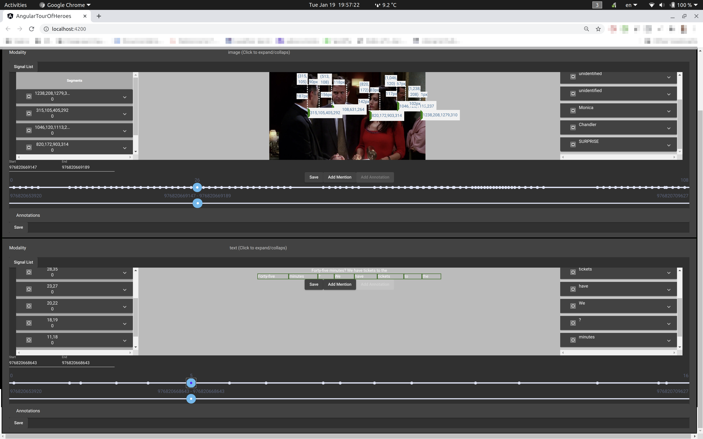

# friends

This directory includes jupyter notebooks with which you can save MELD friends videos into GMRC annotation format.
Below is an example.


> Age (a floating point number from 0 to 100), gender (femaleness on a scale from 0 to 1), and the face recognition (somehow not displayed. It's a TODO) are predicted by machine, not human! See https://github.com/leolani/cltl-face-all for more details.

## Things to note

- The unit of the unix time stamps is milliseconds.
- Probably this is not perfect (work in progress).

## Requirements

1. You have to run this on your local machine. This is intended since you'll have to run the webapp locally to test it anyways. I only tested it on Python3.7.9, x86-64 Ubuntu machine. It'll probably work fine on a Mac too. On your local machine, install the requriements by
    ```
    pip install -r requirements.txt
    ```
    I highly recommend you to run above command in your virtual python environment.

1. To test this on the GUI webapp, read the `README.md` in the root directory of this git repo. 


## jupyter notebooks

- `meld2gmrc.ipynb`

  Run this locally to do everything at one go (You still have to manually load the GUI webapp later though.)

## Authors

- Taewoon Kim (t.kim@vu.nl)
